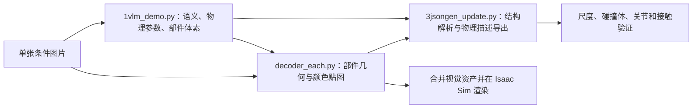
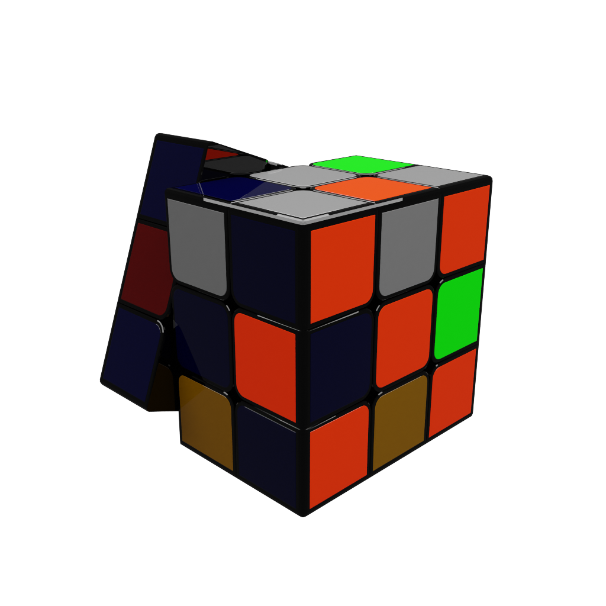
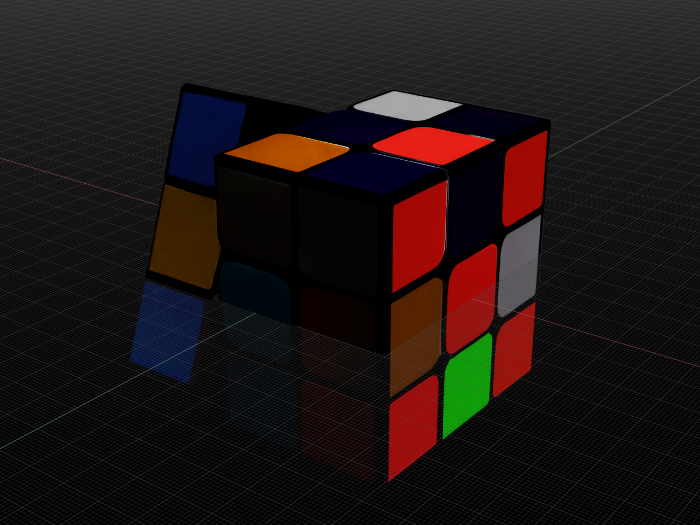
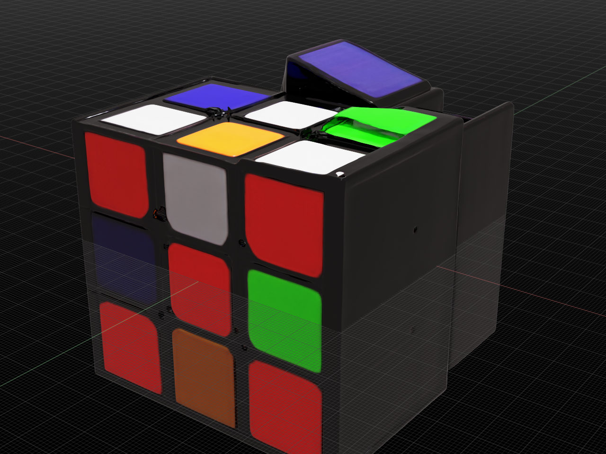

# PhysX-Omni：从单图到彩色仿真资产的复现经验

本章用一个魔方样例，解释 PhysX-Omni 如何把图片转成部件几何、颜色贴图和物理结构描述，并在 Isaac Sim 中完成可视化。实验于 2026 年 6 月完成，2026 年 9 月整理代码与证据。这里验证到的是单图推理、26 个部件导出和仿真器渲染；没有进行模型训练、论文基准复测、关节动力学验证或机器人抓取实验。

魔方适合观察这条链路：颜色块能检查贴图是否保留，直边和平面能暴露几何误差，转动层能检查部件与关节描述是否合理。可见的 26 个外部块只是结构数量的一个检查项，不能据此认定模型恢复了真实魔方机构。

## 1. 先理解三个模块的分工

PhysX-Omni 是生成框架；PhysXVerse 是相关物理三维数据集；PhysX-Bench 是评测工具。它们分别承担资产生成、训练数据和评估。本章只使用预训练模型与仓库样例，不需要把训练数据集全部下载到本地。



图 1 本次复现的数据流。最后一项是机器人应用所需的后续验收，未在本实验中完成。

`1vlm_demo.py` 调用基于 Qwen2.5-VL 微调的 VLM［视觉语言模型］，先生成 `basic_info.txt`，内容包括类别、尺寸、材质、密度、部件和运动关系。随后逐部件生成 64³ 体素空间的 RLE［游程编码］文本，再解码成坐标数组 `ind_<编号>.npy`，合并为 `allind.npy`。语义文本和体素坐标是下游的共同输入契约。

`decoder_each.py` 将稀疏体素坐标和条件图片交给 TRELLIS，恢复部件几何与外观。导出过程还涉及 UV［纹理坐标］参数化和纹理烘焙，得到带材质的 GLB［二进制三维场景格式］及独立网格。本次补丁另外保存每个部件的 `material_0.png`，供物理描述文件引用。

`3jsongen_update.py` 把语义文本解析成 `basic_info.json`，再输出 URDF［统一机器人描述格式］文件 `basic.urdf` 和 MJCF［MuJoCo 模型描述格式］文件 `basic.xml`。其中的密度、弹性参数和关节关系来自模型预测，未经真实物体测量。

## 2. 实际结果与颜色来源



图 2 仓库提供的条件图片。来源为上游 `demo/86e0dfc688cd4927b355015e31455903.png`，不是本教程拍摄的数据。



图 3 本次 26 部件合并后的 Isaac Sim 渲染截图。颜色已经保留，但侧面块存在倾斜，部分表面与网格线叠加，整体不满足精密机械几何要求。这是调试结果，不是完成接触验收的物理资产。

默认颜色由输入图像和生成模型共同决定，不需要先手动指定每一面的颜色。纹理烘焙把生成外观投到网格表面，渲染器再根据材质、灯光和相机形成最终图像。如果需要完全指定颜色，可在导出后替换贴图或材质；这不改变物体的碰撞形状。



图 4 绕过语义与部件推理、只进行六步快速几何生成的早期预览。它在完整模型分片重新下载完成前已经出图，因此“看到魔方”不能证明所有模型已经下载完毕。两张结果的流程和参数不同，不能把外观差别当成严格的质量对比实验。

透明感与错位的根因尚未完成定位。应分别检查原始部件的坐标、场景节点变换、法线、材质透明度、转换后的场景以及视口网格显示。仅靠截图不能断言这些现象全部来自生成模型。

## 3. Blackwell 环境的关键经验

实验使用 NVIDIA RTX PRO 6000 Blackwell Workstation Edition，计算能力为 `(12, 0)`。这不是最低硬件要求，也没有测出最小显存需求。历史可用组合如下，后续更换版本仍需重新执行算子验证。

| 组件 | 历史验证版本或设置 |
| --- | --- |
| PyTorch | `torch==2.7.0+cu128` |
| 图像与音频配套包 | `torchvision==0.22.0+cu128`、`torchaudio==2.7.0+cu128` |
| 注意力实现 | `xformers==0.0.30`，显式选择 CUTLASS［矩阵运算内核库］算子 |
| 稀疏卷积 | `spconv-cu120==2.3.6`、`cumm-cu120==0.4.11` |
| 几何与光栅化 | `kaolin==0.18.0`、`nvdiffrast==0.4.0` |
| 模型加载 | `transformers==4.50.0`、`numpy==1.26.4` |
| 高斯光栅化扩展 | 从源码编译 `diff_gaussian_rasterization`，指定 `TORCH_CUDA_ARCH_LIST=12.0` |

表 1 这台工作站跑通推理时的核心组合。`cu128` 表示对应 CUDA［通用并行计算平台］12.8 的构建版本。

原始依赖中的 `torch==2.1.1+cu118` 不适合作为本次 Blackwell 复现的安装起点。安装成功和能够导入包只验证了部分条件；扩展仍可能在真正执行显卡算子时报告 `no kernel image is available for execution on the device`。

本次在四处注意力实现中显式指定算子，避免自动选择不兼容的实现：

```python
from xformers.ops import fmha

out = xops.memory_efficient_attention(
    q, k, v, op=(fmha.cutlass.FwOp, fmha.cutlass.BwOp)
)
```

这一修改与历史版本绑定，不代表所有 Blackwell 环境都必须强制采用同一种实现。另一个独立问题是 `flash_attn` 缺失，语义推理脚本增加了 SDPA［缩放点积注意力］回退。高斯光栅化扩展则需要确认编译目标，而不是只看主框架支持的显卡架构。

## 4. 复现材料与目录约定

本章提供 [兼容补丁](patches/blackwell.patch)、[渲染脚本](scripts/render_glb_in_isaac.py) 和小型证据。补丁基于整理时的上游提交 `5ba54ee3d0e11c8690fd414d2343d47e514930dd` 导出；历史完整运行发生在六月，未记录六月精确提交号，因此不把九月提交称为原实验版本。补丁的应用检查不等于重新执行了全套推理。

以下命令在 Linux 环境使用。先把 `TUTORIAL_DIR` 改成当前章节绝对路径，把 `DATA_ROOT` 指向实际的大容量磁盘。模型、环境、缓存和输出均写入大容量磁盘，源码单独管理。本机默认大盘根目录为 `/data/Data14TB`。

```bash
export TUTORIAL_DIR="/path/to/every-embodied/10-具身智能其他仿真工具及仿真前沿/14-PhysX-Omni彩色资产生成实践"
export DATA_ROOT="/data/Data14TB"
export PROJECT_ROOT="$DATA_ROOT/01Proj/PhysX-Omni"
export MODEL_ROOT="$DATA_ROOT/models/physx-omni"
export RUN_ROOT="$DATA_ROOT/outputs/physx-omni"
export ENV_ROOT="$DATA_ROOT/envs/physx-omni"
export HF_HOME="$DATA_ROOT/cache/huggingface"
export PIP_CACHE_DIR="$DATA_ROOT/cache/pip"
export TORCH_HOME="$DATA_ROOT/cache/torch"
export TORCH_EXTENSIONS_DIR="$DATA_ROOT/cache/torch_extensions"
mkdir -p "$MODEL_ROOT" "$RUN_ROOT" "$DATA_ROOT/01Proj" "$DATA_ROOT/envs"
git clone --recurse-submodules https://github.com/physx-omni/PhysX-Omni.git "$PROJECT_ROOT"
cd "$PROJECT_ROOT"
git checkout 5ba54ee3d0e11c8690fd414d2343d47e514930dd
git apply --check "$TUTORIAL_DIR/patches/blackwell.patch"
git apply "$TUTORIAL_DIR/patches/blackwell.patch"
```

已有工作副本应先检查自己的修改，不要重复应用补丁。补丁覆盖语义推理回退、分阶段生成长度、解释器选择、本地模型路径、贴图保存及注意力兼容；它也允许缺少网格修复依赖时跳过部分后处理，可能影响几何质量。

完整环境涉及多个原生扩展，本章保留已验证版本及关键修改，不提供未经重新验证的一键安装脚本。基础环境可按下例建立，再依据上游安装说明逐项安装表 1 的其余依赖；不要直接覆盖安装原始整份依赖清单。

```bash
python3.10 -m venv "$ENV_ROOT"
source "$ENV_ROOT/bin/activate"
python -m pip install --upgrade pip
python -m pip install torch==2.7.0 torchvision==0.22.0 torchaudio==2.7.0 \
  --index-url https://download.pytorch.org/whl/cu128
python -m pip install transformers==4.50.0 numpy==1.26.4 qwen-vl-utils 'accelerate>=0.26.0'
```

检查点 1：除确认 `torch.cuda.get_device_capability()` 外，还应实际运行注意力、稀疏卷积和光栅化算子。只有实际运算成功，才进入模型加载。历史检查脚本曾使用默认注意力选择，与强制算子的主流程不同，不能不加核对地当作完全等价测试。

## 5. 下载与校验：文件能打开仍可能损坏

官方模型入口是 [PhysX-Omni 权重](https://huggingface.co/PhysX-Omni/PhysX-Omni) 和 [TRELLIS 图像条件模型](https://huggingface.co/microsoft/TRELLIS-image-large)。源码还加载 Qwen2.5-VL 的图像与文本处理配置；这不意味着需要额外下载整个基础模型权重。

以下命令在已安装项目依赖的环境中运行，接续上一节的环境变量：

```bash
python - <<'PY'
import os
from pathlib import Path
from huggingface_hub import snapshot_download

root = Path(os.environ['MODEL_ROOT'])
snapshot_download('PhysX-Omni/PhysX-Omni', local_dir=root / 'vlm')
snapshot_download('microsoft/TRELLIS-image-large', local_dir=root / 'trellis')
PY
```

本实验曾出现模型持续输出重复的 `Rencontre`，最后因无有效部件坐标而拼接失败。检查发现前三个权重分片的 SHA256［安全散列校验值］与官方元数据不同，第四个一致。替换损坏文件后，同一张图片可以生成结构文本与部件坐标。排查时应先检查权重完整性，再讨论提示词和模型能力。

历史校验值保存于 [分片校验清单](assets/vlm-sha256.txt)。下载后执行：

```bash
cd "$MODEL_ROOT/vlm"
sha256sum -c "$TUTORIAL_DIR/assets/vlm-sha256.txt"
cd "$PROJECT_ROOT"
```

检查点 2：四项均应返回 `OK`。清单对应历史权重字节；如果官方更新版本，应核对对应版本的远端元数据，不能把不同版本的校验值混用。语义推理曾对简单文本指令同样退化，这个现象帮助把问题范围缩小到模型加载与权重。

历史网络环境下，带断点续传的下载工具比高并发分片稳定。这个结论只适用于当时的网络路径，不是对所有下载工具的通用排名。下载完成应以内容校验为准，不能用文件名存在、文件大小相近或已有预览图替代。

## 6. 单图推理与部件导出

`1vlm_demo.py` 的输出目录写死为当前工作目录下的 `ours_demo`。新副本可用符号链接将其放到大盘。下面命令要求该路径尚不存在，已有输出应先检查，不要覆盖。

```bash
cd "$PROJECT_ROOT"
mkdir -p "$RUN_ROOT/input" "$RUN_ROOT/ours_demo"
ln -s "$RUN_ROOT/ours_demo" ours_demo
cp "$TUTORIAL_DIR/assets/input.png" "$RUN_ROOT/input/sample.png"
export ATTN_BACKEND=xformers
export XFORMERS_DISABLED=1
export SPCONV_ALGO=native
export TRELLIS_MODEL_PATH="$MODEL_ROOT/trellis"
python 1vlm_demo.py --imagepath "$RUN_ROOT/input" --modelpath "$MODEL_ROOT/vlm"
python decoder_each.py --name sample --basepath ours_demo --imgpath ours_demo/sample/cond_img.png
python 3jsongen_update.py --basepath ours_demo
```

检查点 3：第一步应生成语义文本与有效坐标，第二步应逐部件生成网格及贴图，第三步应能解析结构描述。历史样例输出 26 个部件，每个目录有 `.glb`、`.obj` 和 `material_0.png`。不能只数目录：批处理脚本以目录数量判断完成，残缺目录可能造成误跳过。

完整生成耗时没有保存可复核的统一计时，本章不提供预计分钟数。首次下载、扩展编译、部件数和纹理烘焙都会影响总耗时。

## 7. 导入 Isaac Sim 应检查什么

本次先把部件合并成视觉场景，再转换为 USD［通用场景描述格式］并拍摄。因此这张渲染图没有证明物理描述中的关节或碰撞已经在 Isaac Sim 中生效。

合并时必须保留各节点变换。历史合并过程直接遍历几何对象，未显式保留节点变换；若原文件包含非单位变换，这会引入位置错误。重新导出应先核对场景图，不能把偏移全部归因于模型预测。

随附渲染脚本接受 `PHYSX_OMNI_RENDER_INPUT` 与 `PHYSX_OMNI_RENDER_OUTPUT`，要求输入为已准备好的整体彩色场景。`ISAACSIM_BIN` 指向独立安装且已完成首次初始化的 Isaac Sim 5.1 入口，不要将它安装进生成模型环境。

```bash
export ISAACSIM_BIN="/path/to/isaacsim"
export PHYSX_OMNI_RENDER_INPUT="$RUN_ROOT/ours_demo/sample/sample_full_parts.glb"
export PHYSX_OMNI_RENDER_OUTPUT="$RUN_ROOT/ours_demo/sample/isaac_render.png"
"$ISAACSIM_BIN" --enable omni.kit.asset_converter \
  --enable omni.kit.viewport.utility --enable omni.kit.capture.viewport \
  --/app/window/enabled=false \
  --exec "$TUTORIAL_DIR/scripts/render_glb_in_isaac.py"
```

这是历史调试脚本，需要自行准备合并输入，未包装成自动合并工具。首次曾截到空网格，改为汇总实际网格包围盒后获得可见物体。截图存在仍不足以证明成功，应打开图片确认物体在画面中。历史脚本还出现截图生成后进程未退出的问题，需检查目标任务后结束对应进程；不要把退出挂起写成渲染未完成。

## 8. 机器人操作前的物理验收

本例语义文件预测尺寸为 `5.7*5.7*5.7`，单位约定需要与导出代码一起核对。整理时发现 `3jsongen_update.py` 使用 `re.findall(r'\d+', ...)`，把小数 `5.7` 拆成 `5` 与 `7`，随后计算出 `0.07` 的缩放；若目标边长是 5.7 厘米，正确转换应为 `0.057` 米。随附历史补丁没有修复此处，复用物理描述前必须处理小数解析和单位。

URDF［统一机器人描述格式］样例主要包含视觉几何，缺少显式 `<collision>`。MJCF［MuJoCo 模型描述格式］样例引用网格作为碰撞几何，但引用三角网格不等于求解器按每个三角面精确接触，实际近似取决于引擎及配置。必须在目标仿真器里显示碰撞形状并做接触测试。

魔方宜采用规则化的实体块与明确的碰撞体，先验证单个刚体的尺度、质量和桌面接触，再研究可转动机构。把 26 个方块随意用固定转轴连接，并不能保证能连续完成真实魔方的多层转动。模型预测的三个连接组和两个转动关系仅是待验证结构假设。

对奶龙这类不规则玩具，可保留高细节外观，再为碰撞构建较低复杂度的凸分解；需要表达凹部时，可评估 SDF［有符号距离场］碰撞，具体取决于仿真器支持。验收应覆盖落地是否穿透、静置是否抖动、夹爪闭合是否异常弹飞，以及真实尺度下的接触位置。若要模拟软玩具，还需要材料、体积离散和相应求解器验证，仅有弹性参数文本不够。

## 9. 小型证据与大文件管理

本章保留条件图、两张截图、语义描述、历史物理描述、补丁和渲染脚本。`assets/evidence/basic.urdf` 与 `assets/evidence/basic.xml` 用于阅读结构，引用的大网格已经清理，不能直接作为完整模型加载。

模型权重可从官方入口恢复；本次未训练出需要独立保存的新权重，也未下载完整训练数据集。按空间清理要求，删除项目内两套预训练模型及大型生成目录，不向 Datawhale 重复上传官方模型。删除清单及字节数见 [存储清单](assets/storage-manifest.json)。生成网格本次选择删除，没有远端备份；复现需要重新推理，未保证逐字节重现。

上游代码随附 S-Lab［研究机构非商业许可］协议，原文保存在 `patches/UPSTREAM_LICENSE`；模型页面的许可标注与代码许可应分别核对。第三方代码补丁及官方图片保留来源，不因放进教程目录而自动变更许可。访问令牌不应写入命令示例、补丁或证据文件。

## 10. 参考与延伸

- [PhysX-Omni 官方仓库](https://github.com/physx-omni/PhysX-Omni)：生成代码、训练入口、数据集与评测目录。
- [PhysX-Omni 项目页](https://physx-omni.github.io/)：论文与方法展示入口。
- [PhysX-Omni 预训练模型](https://huggingface.co/PhysX-Omni/PhysX-Omni)：本次语义与体素推理权重。
- [TRELLIS 官方仓库](https://github.com/microsoft/TRELLIS)：三维生成及安装说明。
- [TRELLIS 图像条件权重](https://huggingface.co/microsoft/TRELLIS-image-large)：部件解码所用模型入口。
- [PhysXVerse 数据集](https://huggingface.co/datasets/PhysX-Omni/PhysXVerse)：训练数据入口，本章单图推理无需完整下载。
- [Isaac Sim 部署导览](../01Isaac部署与GR00T实践/00Isaac部署导览.md)：目标仿真环境的独立安装说明。
