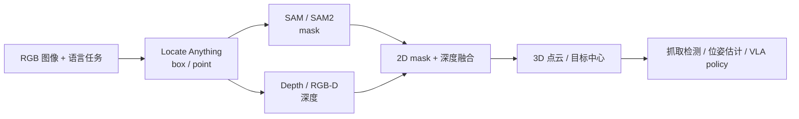

<!-- Generated by the offline translation workflow.
Source: 04-具身场景的计算机视觉、3D重建/04-Locate-Anything视觉语言定位.md
Source SHA-256: ac3b0cc56f611852d952f73c560557f7c01228aff743ab37df7fc5fe5eab7460
Model: tencent/Hy-MT2-1.8B-GGUF:Q4_K_M
Review machine-translated technical claims before relying on them.
-->
# 04-Locate Anything: Convert natural language into visual positioning boxes for robots

Locate Anything is a visual language localization model released by NVIDIA. It addresses a straightforward problem: given a image and a natural language sentence, the model outputs a 2D box or point of the target. For embodied AI, it is neither a VLA policy nor a grasping planner, but rather a language condition-aware front-end that is well-suited to be connected before VLA, SAM, depth estimation, and grasping modules.

After completing this chapter, you can finish three tasks:

- Download and run `nvidia/LocateAnything-3B` locally.
- Compare the output and speed of Locate Anything and YOLO26n using the same diagram.
- Understand why it implements Parallel Box Decoding, and where it should be placed in the robot pipeline.

> This chapter places the environment, model weights, and running outputs in the main directory `$DATA_ROOT`. The tutorial repository only retains the Markdown format and lightweight result charts. Model weights, HF cache, pip cache, and running logs should not be submitted to the repository.

## 1. Where is it suitable to be placed in the embodied system?

The input of Locate Anything is images and text, and the output is a structured text similar to the following:

```text
<ref>bus</ref><box><0><211><997><681></box>
```

The coordinate is a normalized integer ranging from 0 to 1000. It is then mapped back to the original pixels during post-processing. It is suitable for:

| Task | Role of Locate Anything | Subsequent Modules |
| :--- | :--- | :--- |
| Language-conditioned Object Localization | Convert “people in cream-colored coats”, “drawer handles”, and “top-right buttons” into 2D boxes | crop, SAM, depth estimation |
| Automatic Data Annotation | Generate candidate boxes for real robot images in batches | manual review, training set cleaning |
| VLA/VLM Perception Enhancement | Provide task-related regions to the policy model | VLA policy, memory writer |
| GUI/OCR/Document Locating | Locate buttons, text, tables, and title regions | multi-modal agent, RPA |

It does not directly output the 6D pose, grasping pose, contact state, path planning, or closed loop control signals. If you want to use it for robotic arm grasping, a more reasonable workflow would be:



## II. Local Validation Environment

This chapter runs successfully in the following environment:

| Item | Local verification value |
| :--- | :--- |
| GPU | NVIDIA RTX PRO 6000 Blackwell Workstation Edition 96GB |
| Driver / CUDA | NVIDIA Driver 580.159.03, `nvidia-smi` shows CUDA 13.0 |
| PyTorch | `torch==2.11.0+cu128` |
| Locate Anything | NVlabs/Eagle `Embodied` directory, `nvidia/LocateAnything-3B` |
| Transformers | `transformers==4.57.1` |
| YOLO reference | `ultralytics==8.4.80`, `yolo26n.pt` |

During this machine's smoke test, `flash_attn` or `MagiAttention` was not installed, and it can be seen in the logs that the model automatically falls back to PyTorch SDPA:

```text
flash_attn is not available for MoonViT inference; falling back to sdpa.
magi_attention not available, falling back to sdpa.
```

Therefore, the speed in this chapter is only a record of the "basic environment being functional," not an official peak benchmark. The official README reports that Locate Anything-3B achieves 12.7 BPS in Hybrid Mode on a single H100; the speed measured in this chapter is based on SDPA fallback, and when there are other tasks running on the GPU.

## III. Environment and Model Preparation

Define several directories first. You can replace `$DATA_ROOT` with your own dashboard path; do not add model weights to the tutorial repository.

```bash
export DATA_ROOT=/path/to/large_disk/locate-anything
export ENV_ROOT=/path/to/large_disk/envs/locate-anything
export HF_HOME=/path/to/large_disk/cache/huggingface
export PIP_CACHE_DIR=/path/to/large_disk/cache/pip
export UV_CACHE_DIR=/path/to/large_disk/cache/uv
export TORCH_EXTENSIONS_DIR=/path/to/large_disk/cache/torch_extensions

mkdir -p "$DATA_ROOT" "$HF_HOME" "$PIP_CACHE_DIR" "$UV_CACHE_DIR" "$TORCH_EXTENSIONS_DIR"
```

If `/data/Data14TB` is used as the dashboard just like on this machine, you can set it up as follows:

```bash
export DATA_ROOT=/data/Data14TB/01Proj/locate-anything
export ENV_ROOT=/data/Data14TB/envs/locate-anything
export HF_HOME=/data/Data14TB/cache/huggingface
export PIP_CACHE_DIR=/data/Data14TB/cache/pip
export UV_CACHE_DIR=/data/Data14TB/cache/uv
export TORCH_EXTENSIONS_DIR=/data/Data14TB/cache/torch_extensions
```

Clone the official repository:

```bash
cd "$DATA_ROOT"
git clone --depth 1 https://github.com/NVlabs/Eagle.git
cd "$DATA_ROOT/Eagle/Embodied"
```

Create a Python 3.11 environment:

```bash
uv venv "$ENV_ROOT" --python 3.11
"$ENV_ROOT/bin/python" -m ensurepip --upgrade
"$ENV_ROOT/bin/python" -m pip install --upgrade pip wheel setuptools
```

Install the PyTorch CUDA 12.8 wheel. The local Driver shows CUDA 13.0, but the cu128 wheel works properly:

```bash
"$ENV_ROOT/bin/python" -m pip install torch torchvision \
  --index-url https://download.pytorch.org/whl/cu128
```

Verify CUDA:

```bash
"$ENV_ROOT/bin/python" - <<'PY'
import torch
print("torch", torch.__version__)
print("cuda available", torch.cuda.is_available())
print("cuda version", torch.version.cuda)
if torch.cuda.is_available():
    print("device", torch.cuda.get_device_name(0))
PY
```

This machine output:

```text
torch 2.11.0+cu128
cuda available True
cuda version 12.8
device NVIDIA RTX PRO 6000 Blackwell Workstation Edition
```

Install the dependencies for Locate Anything:

```bash
cd "$DATA_ROOT/Eagle/Embodied"
"$ENV_ROOT/bin/python" -m pip install -e .
```

Key dependencies of the official project include `transformers==4.57.1`, `tokenizers==0.22.0`, `deepspeed==0.15.4`, `accelerate==1.5.2`, `timm>=1.0.11`, `liger_kernel==0.3.1`, `peft==0.12.0`, and `decord`.

Download model:

```bash
export MODEL_DIR="$DATA_ROOT/models/LocateAnything-3B"
mkdir -p "$DATA_ROOT/models"

"$ENV_ROOT/bin/hf" download nvidia/LocateAnything-3B \
  --local-dir "$MODEL_DIR"
```

After this machine downloads, the model directory is approximately 7.3GB in size, and the two main weight files are:

```text
model-00001-of-00002.safetensors  4.7G
model-00002-of-00002.safetensors  2.6G
```

If the download is interrupted, simply running the same `hf download` command again will allow the download to continue from where it left off.

## IV. Locate Anything smoke test

We first use the official example image of Ultralytics `bus.jpg` for a smoke test, so as to compare it with YOLO26 later.

```bash
export IMAGE_PATH="$DATA_ROOT/bus.jpg"
curl -L https://ultralytics.com/images/bus.jpg -o "$IMAGE_PATH"
```

Figure 1 is the input image.


Run Locate Anything:

```bash
cd "$DATA_ROOT/Eagle/Embodied"

HF_HOME="$HF_HOME" \
TORCH_EXTENSIONS_DIR="$TORCH_EXTENSIONS_DIR" \
PYTORCH_CUDA_ALLOC_CONF=expandable_segments:True \
MODEL_DIR="$MODEL_DIR" \
IMAGE_PATH="$IMAGE_PATH" \
DATA_ROOT="$DATA_ROOT" \
"$ENV_ROOT/bin/python" - <<'PY'
import json, os, time
from pathlib import Path
from PIL import Image, ImageDraw
from locateanything_worker import LocateAnythingWorker

model_path = Path(os.environ["MODEL_DIR"])
image_path = Path(os.environ["IMAGE_PATH"])
out_dir = Path(os.environ["DATA_ROOT"]) / "runs/bus_locateanything"
out_dir.mkdir(parents=True, exist_ok=True)

img = Image.open(image_path).convert("RGB")
worker = LocateAnythingWorker(str(model_path), use_batch_runtime=False)

queries = [
    ("bus", "Locate a single instance that matches the following description: bus."),
    ("persons", "Locate all the instances that matches the following description: person."),
    (
        "front_person",
        "Locate a single instance that matches the following description: "
        "the man in the cream coat standing in front of the bus.",
    ),
]

summary = []
for name, prompt in queries:
    t0 = time.time()
    result = worker.predict(
        img,
        prompt,
        generation_mode="hybrid",
        max_new_tokens=512,
        temperature=0.2,
        top_p=0.9,
        verbose=True,
    )
    wall = time.time() - t0
    boxes = LocateAnythingWorker.parse_boxes(result["answer"], *img.size)

    vis = img.copy()
    draw = ImageDraw.Draw(vis)
    for i, b in enumerate(boxes):
        draw.rectangle([b["x1"], b["y1"], b["x2"], b["y2"]], outline="red", width=4)
        draw.text((b["x1"] + 4, max(0, b["y1"] - 20)), f"{name}-{i}", fill="red")

    vis_path = out_dir / f"{name}_locateanything_result.jpg"
    vis.save(vis_path)
    summary.append(
        {
            "name": name,
            "prompt": prompt,
            "answer": result["answer"],
            "stats": result.get("stats"),
            "wall_infer_seconds": round(wall, 4),
            "boxes": boxes,
            "image": str(vis_path),
        }
    )
    print(name, round(wall, 4), result["answer"])

(out_dir / "summary.json").write_text(
    json.dumps(summary, ensure_ascii=False, indent=2), encoding="utf-8"
)
PY
```

The results of the three queries by this machine are as follows:

| Prompt | Output Summary | Local Time |
| :--- | :--- | :--- |
| `bus` | 1 bus frame |约 1.00s |
| `person` | 4 pedestrians frames |约 0.63s |
| `the man in the cream coat standing in front of the bus` | A person referred to by natural language |约 0.63s |

Bus positioning results:


Pedestrian multi-object positioning results:


Natural language refers to the expression of positioning results:


Please pay special attention to Figure 4: This is not simply detecting `person` types, but identifying "people wearing cream-colored coats standing in front of a bus" among multiple pedestrians. This is precisely why Locate Anything is more valuable than ordinary fixed category detectors.

## 5. Compare with YOLO26n in the same diagram

YOLO26 is a real-time visual model family released by Ultralytics. The official documentation states that it supports tasks such as detection, segmentation, pose, classification, and oriented detection. The detection model covers 80 pre-trained categories on COCO, and it emphasizes low-latency deployment without NMS.

To avoid disrupting the `numpy<2` constraints of Locate Anything, this chapter uses `--no-deps` when installing Ultralytics in the same environment, and manually adds a few dependencies. A cleaner approach is to create a separate environment for YOLO.

```bash
"$ENV_ROOT/bin/python" -m pip install --no-deps \
  ultralytics polars polars-runtime-32 nvidia-ml-py ultralytics-thop
```

Run YOLO26n:

```bash
export YOLO_CONFIG_DIR=/path/to/large_disk/cache/ultralytics
mkdir -p "$YOLO_CONFIG_DIR/Ultralytics"

cd "$DATA_ROOT"

YOLO_CONFIG_DIR="$YOLO_CONFIG_DIR" \
DATA_ROOT="$DATA_ROOT" \
"$ENV_ROOT/bin/python" - <<'PY'
import json, os, time
from pathlib import Path
from PIL import Image as PILImage
from ultralytics import YOLO

data_root = Path(os.environ["DATA_ROOT"])
image = data_root / "bus.jpg"
out_dir = data_root / "runs/bus_yolo26n"
out_dir.mkdir(parents=True, exist_ok=True)

model = YOLO("yolo26n.pt")

# 先跑一次预热，再记录第二次速度。
model.predict(str(image), imgsz=640, conf=0.25, device=0, verbose=False)
t0 = time.time()
results = model.predict(str(image), imgsz=640, conf=0.25, device=0, verbose=False)
wall = time.time() - t0

r = results[0]
items = []
for b in r.boxes:
    cls_id = int(b.cls[0])
    items.append(
        {
            "class": model.names[cls_id],
            "confidence": round(float(b.conf[0]), 4),
            "xyxy": [float(x) for x in b.xyxy[0].cpu().tolist()],
        }
    )

plot = r.plot()
plot_path = out_dir / "bus_yolo26n_result.jpg"
PILImage.fromarray(plot[..., ::-1]).save(plot_path)
(out_dir / "bus_yolo26n_result.json").write_text(
    json.dumps(
        {
            "model": "yolo26n.pt",
            "wall_infer_seconds": round(wall, 4),
            "speed_ms": r.speed,
            "boxes": items,
        },
        ensure_ascii=False,
        indent=2,
    ),
    encoding="utf-8",
)

print("wall seconds", round(wall, 4))
print("speed ms", r.speed)
print("boxes", items)
PY
```

This machine YOLO26n outputs 5 boxes: 1 `bus` and 4 `person`. The internal processing time of the preheated model is:

```text
preprocess: 2.38 ms
inference: 4.12 ms
postprocess: 0.80 ms
```


### Comparison Conclusion

| Dimension | YOLO26n | Locate Anything-3B |
| :--- | :--- | :--- |
| Core Function | Real-time fixed class detector | Visual language grounding model |
| Input | Image, default output: COCO classes | Image + natural language prompt |
| Output | Classes, confidence scores, boxes | `<ref>...</ref><box>...</box>` or points |
| Local inference speed | Approximately 4.12 ms for model inference | Approximately 0.63 s to 1.00 s for generative positioning |
| Parameter scale | YOLO26n official table: 2.4M parameters; YOLO26x: 55.7M | Model card states 3B parameters |
| Advantageous tasks | Fixed classes, real-time video streams, edge deployment | Referring, GUI, OCR, layout, open vocabulary positioning |
| Robot applications | Quick detection of common categories such as people, vehicles, cups, bottles, etc. | Finding target regions based on task-specific language, e.g., "the red cup handle on the left" |

If the task is simply “is there anyone, a car, or a cup in the camera”, YOLO26n is clearly faster and uses less memory, making it more suitable for real-time deployment. If the task is “find someone wearing a cream-colored coat standing in front of a bus”, or “find the download button in the upper right corner of a web page”, “the first paragraph under the document summary title”, or “a transparent cup on the desktop near the gripper”, Locate Anything is more appropriate for the task.

It should be noted that Ultralytics has also released YOLOE-26, which supports open vocabulary detection and segmentation using text prompts and visual prompts. YOLOE-26 is closer to a "real-time open vocabulary detector," but Locate Anything has a more VLM grounding-based positioning range, covering structured scenarios such as GUI, OCR, layout, referring, and pointing. When working on academic paper-related tasks, do not simply treat them as interchangeable; a more accurate description is:

```text
YOLO26 / YOLOE-26：实时检测与分割模型族，重部署速度和检测任务。
Locate Anything：通用视觉语言定位器，重自然语言 grounding 和多域结构化定位。
```

## VI. Why PBD / MTP is Faster

Traditional generative grounding can output coordinates as ordinary text tokens:

```text
<box> <x1> <y1> <x2> <y2> </box>
```

If using NTP, that is, Next Token Prediction, the model must first generate `x1`, then `y1`, then `x2`, and finally `y2`. There are two issues:

1. The coordinate generation process is complex and slow.
2. The four coordinates of a box form a geometric whole. When generated token by token, the structure may become inconsistent.

The core idea of Locate Anything is Parallel Box Decoding, abbreviated as PBD. It treats a box or point as a fixed-length atomic unit, allowing the complete coordinates to be predicted in a parallel step. The official README describes it as multi-token prediction with box alignment: Fast Mode uses MTP, Slow Mode uses NTP, and Hybrid Mode defaults to MTP. If there are format errors or spatial ambiguities, it locally reverts to NTP.

You can understand it like this:

| Decoding Method | Approach | Suitable Scenario |
| :--- | :--- | :--- |
| NTP / Slow | Generate one token at a time | Prioritizing stability, offline annotation |
| MTP / Fast | Predict multiple tokens simultaneously | Prioritizing speed |
| PBD / Hybrid | Parallel prediction using boxes as geometric blocks, with fallback when needed | Default inference |

When this machine runs `person` multiple frames on `bus.jpg`, the Hybrid Mode log shows:

```text
num_tokens=28
generate_time(s)=0.6157
forward_step=9
num_boxes=4
bps=6.4966
switch_to_ar=1
```

Here, `switch_to_ar=1` indicates that an autoregressive fallback was indeed triggered in the Hybrid Mode. When running a single `bus`:

```text
num_tokens=10
generate_time(s)=0.9805
forward_step=3
num_boxes=1
bps=1.0199
switch_to_ar=0
```

These numbers only indicate that the local smoke test has been completed successfully; they should not be directly compared with the official H100 benchmark.

## VII. Common Questions

**1. Can consumer or workstation cards like the RTX 4090 and RTX PRO 6000 run?**

It can run. The compatible architectures listed for NVIDIA model cards include Ampere, Hopper, Blackwell, and Lovelace. The Lovelace example includes the RTX 4090. The local RTX PRO 6000 Blackwell with 96GB of memory can handle BF16 single-image processing without memory issues. A 4090 with 24GB of memory is more suitable for batch=1, low concurrency, offline annotation, or demos; however, 4K high resolution, dense targets, and server-based batch processing still benefit from more memory.

**2. Why was MagiAttention not installed in this chapter?**

The goal of this chapter is to first run through the basic reasoning process. The official README states that MagiAttention is designed for long context training and inference with Hopper / Blackwell. If you want to use long contexts of 16K to 32K or aim for higher batch throughput, install it separately and verify it later. In the basic tutorial, keep SDPA fallback for easier troubleshooting.

**3. Locate Anything returning to `<box>None</box>` is the model broken?**

Not necessarily. It may be due to unclear prompts, images being puzzles/forms that cause ambiguity, or the target not being in the image. In this chapter, when trying to find `car` on the official `teaser.jpg`, None was returned. However, finding `ship` and `crop tool icon` in the same image can yield reasonable boxes. During replication, verify first with a clean image and a clear target, and then test complex scenarios.

**4. Can it replace YOLO26?**

Do not use this way. If the task is real-time fixed-category detection, YOLO26 is more suitable. If the task involves natural language, GUI/OCR/document layout, complex gesture expressions, or robot task semantics, Locate Anything is more valuable. A common combination is: YOLO handles high-speed security detection of common categories, and Locate Anything focuses on target localization related to task language.

**5. How to grasp the robot next step?**

First, use the 2D box of Locate Anything as a prompt for SAM/SAM2 to obtain the mask. Then, deeply fuse the mask region with RGB-D to generate 3D point clouds. Subsequently, GraspNet, 6D pose, traditional grasping detection, or VLA policy can be applied. By breaking it down this way, each layer has clear input and output, making troubleshooting easier.

## VIII. Reference Links

- NVIDIA Locate Anything project page: https://research.nvidia.com/labs/lpr/locate-anything/
- NVlabs/Eagle `Embodied` code: https://github.com/NVlabs/Eagle/tree/main/Embodied
- Hugging Face model card: https://huggingface.co/nvidia/LocateAnything-3B
- Ultralytics YOLO26 documentation: https://docs.ultralytics.com/models/yolo26/
